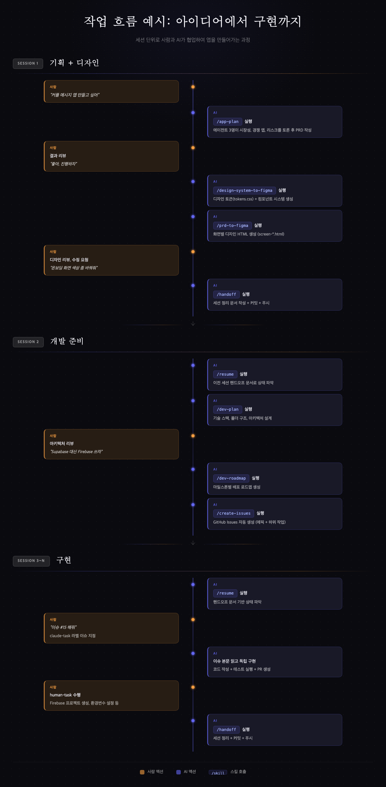

# Side Project Claude Settings

사이드 프로젝트를 **아이디어 → 기획 → 디자인 → 개발 계획 → 이슈 관리 → 구현**까지 Claude Code와 함께 진행하기 위한 플러그인.

플러그인을 설치하면 스킬 15개 + hooks 2개가 자동으로 적용됩니다. 각 스킬은 산출물 기반 전제조건으로 연결되어 있어, 처음 쓰는 사람도 올바른 순서를 자연스럽게 따르게 됩니다.

---

## 설치

```bash
# 마켓플레이스 등록 (최초 1회)
/plugin marketplace add nosorae/side-project-claude-settings

# 플러그인 설치
claude plugin install side-project-claude-settings --scope project
```

이것만 하면 끝입니다. 별도의 초기화 명령 없이 바로 `"앱 기획해줘"` 또는 `/app-plan`으로 시작할 수 있습니다.

---

## 플러그인 설치부터 첫 배포까지

### Step 1. 플러그인 설치

```
/plugin marketplace add nosorae/side-project-claude-settings
claude plugin install side-project-claude-settings --scope project
```

**제공되는 것:**
- 파이프라인 스킬 8개 (기획 → 디자인 → 개발 → 이슈)
- 보조 스킬 7개 (세션 관리, 유틸리티)
- hooks 2개 (대화 기록 저장, SSOT 변경 감지)

**강제 원리:** 플러그인 설치 시 hooks가 자동 등록되어, SSOT 문서가 변경될 때마다 blueprint 업데이트를 리마인드합니다.

### Step 2. 기획 — `/app-plan`

```
> 앱 기획해줘
```

**하는 일:** 3인 에이전트 토론(사용자/비즈니스/기술 관점) → 핵심 가치 정의 → MVP 범위 → 유저 플로우 → PRD 작성

**산출물:** `docs/ssot/prd/YYYY-MM-DD-{앱이름}-기획서.md` + `userflow.html` + `screen-map.html`

**강제 원리:** 이후 모든 스킬(디자인, 개발, 이슈)이 이 기획서의 존재를 전제조건으로 체크합니다. 기획서 없이 디자인을 시작하려 하면:
```
⚠️ 이 스킬을 실행하려면 먼저 /app-plan으로 기획서를 작성해야 합니다.

선택하세요:
a) /app-plan 먼저 실행 (권장)
b) --skip으로 전제조건 건너뛰고 진행 (비권장)
```

> **선택 사항:** 기획 전에 시장성 검증이 필요하면 `/market-research`를 먼저 실행할 수 있습니다. 3인 에이전트(시장 옹호자, 경쟁 분석가, 악마의 변호인)가 토론하여 진행/중단을 판정합니다.

### Step 3. 디자인 시스템 — `/design-system-to-figma`

**전제조건:** 기획서(PRD) 존재 ← Step 2에서 생성

**하는 일:** PRD 분석 → 디자인 토큰(색상, 타이포, 간격) 생성 → 컴포넌트 시스템 HTML 생성

**산출물:** `docs/ssot/design/system/tokens.css` + `design-system.html`

**강제 원리:**
- `frontend-design` 스킬이 미설치면 자동 설치 시도 → 실패 시 **중단** (디자인 품질 보장)
- 생성된 `tokens.css`는 이후 화면 디자인의 필수 전제조건

### Step 4. 화면 디자인 — `/prd-to-figma`

**전제조건:** `tokens.css` 존재 ← Step 3에서 생성

**하는 일:** PRD 화면 정의를 파싱하여 화면별 HTML 생성 (390x844 모바일 프레임)

**산출물:** `docs/ssot/design/screens/screen-{번호}-{이름}.html`

**강제 원리:** `tokens.css` 없이 실행하면 즉시 중단 + `/design-system-to-figma` 안내

### Step 5. 개발 계획 — `/dev-plan`

**전제조건:** 기획서(PRD) 존재 ← Step 2에서 생성

**하는 일:** 기술 아키텍처 설계 → 디렉토리 구조 → 데이터 모델 → API 설계

**산출물:** `docs/ssot/dev/dev-plan.md` + `architecture.html`

**강제 원리 (베스트 프랙티스 스킬 필수 설치):**
기술 스택이 결정되면 해당 플랫폼의 베스트 프랙티스 스킬을 **반드시** 검색/설치합니다. 이 단계는 스킵할 수 없습니다.
1. 마켓플레이스 검색 → 2. GitHub 검색 → 3. 못 찾으면 공식 문서 기반 커스텀 스킬 자동 생성

### Step 6. 배포 로드맵 — `/dev-roadmap`

**전제조건:** `dev-plan.md` 존재 ← Step 5에서 생성

**하는 일:** 마일스톤 분류(M0~M3) → 작업 분류(claude-task/human-task) → 의존성 순서 정의

**산출물:** `docs/ssot/dev/deploy-roadmap.md` + `roadmap-visual.html`

**강제 원리 (작업 배치 순서):**
| 순위 | 타입 | 이유 |
|------|------|------|
| 1순위 | human-task에 의존하지 않는 독립 claude-task | 즉시 병렬 수행 가능 |
| 2순위 | human-task | 사람이 처리하는 동안 1순위와 병렬 |
| 3순위 | human-task에 의존하는 claude-task | human-task 완료 후 |

### Step 7. 이슈 생성 — `/create-issues`

**전제조건:** `deploy-roadmap.md` 존재 ← Step 6에서 생성

**하는 일:** 로드맵 기반 GitHub Issues 자동 생성 (에픽 + 하위 작업, claude-task/human-task 라벨)

**강제 원리:**
- gh CLI 미설치 시 macOS는 자동 설치 시도, 그 외는 안내 후 중단
- 이슈 생성 전 반드시 사용자와 구조/분류 합의

### Step 8. 구현

로드맵의 작업 순서대로 개발을 진행합니다.
- **claude-task**: Claude Code가 독립 수행 (코딩, 테스트, 버그 수정)
- **human-task**: 사람이 직접 수행 (외부 서비스 설정, 앱스토어 등록)

세션이 끊기면 `/handoff`로 핸드오프 문서를 만들고, 다음 세션에서 `/resume`으로 이어합니다.

---

## 전체 흐름 요약

```
플러그인 설치
    ↓
(선택) /market-research → 시장성 검증
    ↓
/app-plan → 기획서(PRD) ──────────────────┐
    ↓                                      ↓
/design-system-to-figma → tokens.css    /dev-plan → 개발 계획서
    ↓                                      ↓
/prd-to-figma → 화면 HTML              /dev-roadmap → 배포 로드맵
                                           ↓
                                       /create-issues → GitHub Issues
                                           ↓
                                        구현 시작
```

---

## 순서 강제 메커니즘 정리

| 메커니즘 | 역할 | 동작 방식 |
|----------|------|----------|
| **산출물 기반 전제조건** | 순서 보장 | 각 스킬이 선행 스킬의 산출물 파일 존재를 체크. 없으면 안내 + skip 선택지 |
| **frontend-design 강제 설치** | 디자인 품질 보장 | HTML 생성 스킬 3개가 실행 전 체크. 미설치 시 자동 설치, 실패 시 중단 |
| **베스트 프랙티스 스킬 필수** | 구현 품질 보장 | dev-plan에서 기술 스택 결정 후 반드시 설치. 스킵 불가 |
| **SSOT 변경 감지 hook** | 문서 동기화 보장 | docs/ssot/ 파일 변경 시 blueprint 업데이트 리마인드 |
| **작업 배치 순서** | 리드타임 최소화 | 독립 claude-task → human-task → 의존 claude-task |
| **대화 기록 hook** | 세션 추적 | 모든 대화를 docs/sessions/에 자동 저장 |

---

## 전체 흐름


---

## 사람과 AI의 역할 분담



| 단계 | 사람 | Claude Code |
|------|------|-------------|
| **시작** | 플러그인 설치 | 스킬 + hooks 자동 적용 |
| **시장 조사** | 아이디어 설명 (선택) | 3인 에이전트 토론으로 시장성 검증 |
| **기획** | 결과 판단, 방향 결정 | 핵심 가치 정의, MVP 범위, PRD 작성 |
| **디자인** | 리뷰, 수정 요청 | 디자인 토큰, 컴포넌트, 화면별 HTML |
| **개발 계획** | 아키텍처 리뷰 | 기술 설계, 베스트 프랙티스 스킬 필수 설치 |
| **구현** | human-task 수행, 코드 리뷰 | claude-task 독립 수행, 테스트, 버그 수정 |
| **세션 관리** | `/handoff` 요청 | 핸드오프 문서 → `/resume`으로 복구 |

---

## 스킬 목록

### 파이프라인 스킬

| 스킬 | 산출물 | 설명 |
|------|--------|------|
| `/interview` | `interview-notes.md` | 점진적 질문으로 요구사항 구체화 (선택) |
| `/market-research` | `*-시장조사.md` | 3인 에이전트 토론으로 시장성 검증 (선택) |
| `/app-plan` | PRD + 유저플로우 HTML | 핵심 가치 → MVP 범위 → 유저 플로우 → PRD |
| `/design-system-to-figma` | `tokens.css` + `design-system.html` | 디자인 토큰 + 컴포넌트 (HTML 기본, Figma 선택) |
| `/prd-to-figma` | `screen-*.html` | 화면별 디자인 HTML (tokens.css 선행 필요) |
| `/dev-plan` | `dev-plan.md` + 아키텍처 HTML | 기술 아키텍처 + 베스트 프랙티스 스킬 필수 설치 |
| `/dev-roadmap` | `deploy-roadmap.md` + 타임라인 HTML | M0~M3 마일스톤, claude-task/human-task 분류 |
| `/create-issues` | GitHub Issues | 에픽 + 하위 작업 자동 생성 |

### 세션 관리 스킬

| 스킬 | 설명 |
|------|------|
| `/handoff` | 세션 종료 시 핸드오프 문서 생성 (10개 필수 섹션 + 커밋) |
| `/resume` | 새 세션 시작 시 프로젝트 상태 파악 + 이어하기 |

### 유틸리티 스킬

| 스킬 | 설명 |
|------|------|
| `/product-blueprint` | SSOT 통합 마스터 HTML (각 스킬 완료 시 자동 업데이트) |
| `/sync-roadmap` | GitHub Issues 상태 기반 로드맵 최신화 |
| `/sync` | Git pull + 충돌 해결 |
| `/ideation` | 8개 에이전트로 앱 아이디어 발굴 |
| `/clarify` | 모호한 이슈/요청을 인터뷰로 구체화 |

---

## Hooks

| Hook | 트리거 | 역할 |
|------|--------|------|
| `log-conversation.sh` | UserPromptSubmit + PostToolUse | 모든 대화를 `docs/sessions/`에 자동 저장 |
| `remind-blueprint-update.sh` | PostToolUse (Write/Edit) | `docs/ssot/` 파일 변경 시 blueprint 업데이트 리마인드 |

---

## 파이프라인 현황 조회

언제든 "현황 보여줘" 또는 "파이프라인 상태"라고 말하면:

```
✅ 기획서 (docs/ssot/prd/2026-04-15-MyApp-기획서.md)
✅ 디자인 토큰 (docs/ssot/design/system/tokens.css)
⬜ 화면 디자인 — 다음 단계: /prd-to-figma
⬜ 개발 계획
⬜ 배포 로드맵
⬜ GitHub Issues
```
