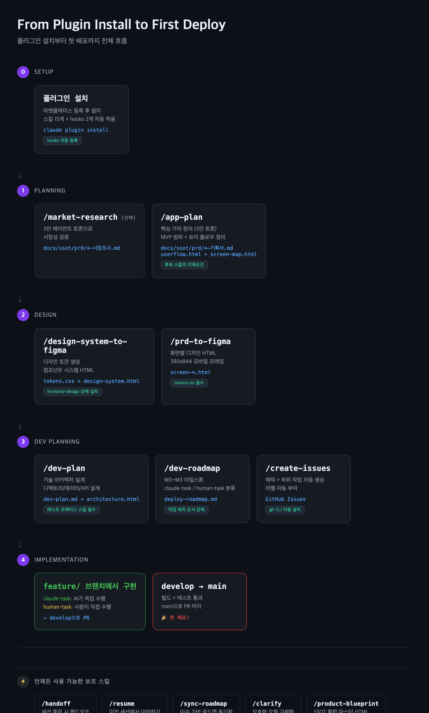

# Side Project Claude Settings

사이드 프로젝트를 혼자서 처음부터 끝까지 만들어보려고 하면, 생각보다 막막한 부분이 많습니다.

"아이디어는 있는데 어디서부터 시작하지?" "기획서는 어떻게 써야 하지?" "디자인은?" "개발은 어떤 순서로?"

이 레포는 그런 문제를 해결하기 위해 만든 **내 개인 Claude Code 세팅**입니다. 아이디어 검증부터 기획, 디자인, 개발 계획, 이슈 관리, 구현까지 — 한 흐름으로 이어지도록 구성했습니다. 각 단계에서 가장 좋은 도구를 골라 조합했고, 직접 만든 것과 외부 플러그인을 섞어 씁니다.

---

## 설치

```bash
/plugin marketplace add nosorae/side-project-claude-settings
claude plugin install side-project-claude-settings --scope project
```

이것만 하면 됩니다. 처음 사용할 때 동반 플러그인 4개(superpowers, slavingia/skills, phuryn/pm-skills, garrytan/gstack)가 설치되어 있는지 자동으로 확인하고, 없으면 설치를 안내합니다.

한번에 전부 설치하고 싶으면:

```bash
bash install-all.sh
```

---

## 전체 프로세스

### 1. 아이디어 검증 — "이거 만들 만한 건가?"

사이드 프로젝트에서 가장 흔한 실수는 검증 없이 바로 만들기 시작하는 겁니다. 몇 주 만들고 나서 "아무도 안 쓰네"를 깨닫는 것보다, 하루 투자해서 검증하는 게 낫습니다.

```
> 이런 앱 아이디어가 있는데, 괜찮은지 검증해줘
```

[slavingia/skills](https://github.com/slavingia/skills)의 `validate-idea`가 이걸 해줍니다. Gumroad 창업자 Sahil Lavingia가 직접 만든 스킬로, Mom Test 방식으로 아이디어를 검증하고 Lean Canvas를 만들어줍니다. 실제로 사업을 해본 사람이 만든 거라 이론이 아니라 실전 경험이 녹아 있습니다.

타겟 고객이 누군지 좀 더 파고 싶으면, [phuryn/pm-skills](https://github.com/phuryn/pm-skills)의 제품 디스커버리 스킬을 씁니다. PM 전문 스킬이 100개 넘게 있어서, 고객 인터뷰 설계부터 우선순위 정리까지 커버됩니다.

이 단계는 선택입니다. 이미 확신이 있는 아이디어라면 바로 기획으로 넘어가면 됩니다.

### 2. 기획 — "뭘 만들 건지 정리하자"

```
> 앱 기획해줘
```

여기서부터 이 플러그인이 동작합니다. `/app-plan`을 실행하면 세 명의 에이전트가 각각 다른 관점에서 토론합니다:

- **사용자 옹호자**: 사용자가 진짜 원하는 게 뭔지
- **비즈니스 전략가**: 어떻게 돈을 벌 건지
- **기술 현실주의자**: AI 코딩으로 실현 가능한지

한 관점으로만 기획하면 편향되기 쉬운데, 세 관점이 부딪히면서 균형 잡힌 결론이 나옵니다. 토론 결과를 바탕으로 핵심 가치, MVP 범위, 유저 플로우를 정하고, 기획서(PRD)를 작성합니다.

이 기획서가 이후 모든 단계의 출발점입니다. 디자인도, 개발 계획도, 이슈도 전부 이 문서를 기반으로 만들어집니다. 기획서 없이 다음 단계를 시작하려 하면 "먼저 기획서를 작성하세요"라고 안내합니다.

**만들어지는 것:**
- `docs/ssot/prd/` 아래에 기획서
- 유저 플로우 다이어그램 (HTML)
- 화면 전환 흐름도 (HTML)

### 3. 디자인 — "어떻게 생긴 건지 보자"

```
> 디자인 시스템 만들어줘
> 화면 디자인해줘
```

기획서에 "금융 앱"이라고 적혀 있으면 블루 계열, "음식 앱"이면 오렌지 계열 — 앱 성격에 맞는 디자인 토큰(색상, 타이포, 간격, 라운딩)을 자동으로 생성합니다. 그리고 그 토큰으로 버튼, 입력 필드, 카드, 네비게이션 같은 컴포넌트 시스템을 HTML로 만들어줍니다.

디자인 시스템이 준비되면, 기획서의 화면 정의를 읽고 각 화면을 390x844 모바일 HTML로 만들어줍니다. 브라우저에서 바로 열어볼 수 있어서, Figma 없이도 디자인을 확인하고 수정할 수 있습니다. Figma로 내보내기도 지원합니다.

디자인 품질을 위해 한 가지 강제하는 게 있습니다. HTML을 생성하기 전에 `frontend-design` 스킬이 설치되어 있는지 확인합니다. 없으면 자동으로 설치하고, 그마저 실패하면 멈춥니다. 디자인 원칙 없이 HTML을 만들면 "AI가 만든 티"가 나는 결과물이 나오기 때문입니다.

**만들어지는 것:**
- `tokens.css` — 디자인 토큰
- `design-system.html` — 컴포넌트 시스템
- `screen-01-로그인.html`, `screen-02-홈.html` ... — 화면별 디자인

### 4. 개발 계획 — "어떻게 만들 건지 정하자"

```
> 개발 계획 세워줘
```

기획서와 디자인을 분석해서 기술 아키텍처, 디렉토리 구조, 데이터 모델, API를 설계합니다.

여기서 중요한 게 하나 있습니다. 기술 스택이 정해지면, 그 스택에 맞는 **베스트 프랙티스 스킬을 실시간으로 검색**해서 설치합니다. 예를 들어 Kotlin + Jetpack Compose로 정해지면 그 시점에 가장 스타가 많고 잘 관리되는 Android 스킬을 찾아서 깔아줍니다.

정적인 추천 목록을 두지 않는 이유가 있습니다. 6개월 전에 좋았던 스킬이 지금은 관리가 안 될 수 있고, 어제 나온 스킬이 더 나을 수 있기 때문입니다. 이 단계는 건너뛸 수 없습니다.

**만들어지는 것:**
- `dev-plan.md` — 개발 계획서
- `architecture.html` — 시스템 구성도

### 5. 배포 로드맵 — "어떤 순서로 만들 건지 짜자"

```
> 로드맵 만들어줘
```

개발 계획을 마일스톤(M0~M3)으로 나누고, 각 작업을 두 가지로 분류합니다:

- **claude-task**: Claude Code가 혼자서 할 수 있는 것 (코딩, 테스트, 설정 파일)
- **human-task**: 사람이 직접 해야 하는 것 (외부 서비스 가입, 앱스토어 등록, 결제 설정)

작업 배치 순서에도 규칙이 있습니다. 사람의 작업에 의존하지 않는 claude-task를 가장 먼저 배치합니다. 사람이 Supabase 프로젝트를 만들고 있는 동안, AI는 프로젝트 초기화, 컴포넌트 구현, 테스트 코드를 미리 다 해놓습니다. 사람이 돌아왔을 때 바로 다음 단계로 갈 수 있도록. 혼자서 프로젝트하는 사람의 시간이 가장 귀하니까요.

**만들어지는 것:**
- `deploy-roadmap.md` — 배포 로드맵
- `roadmap-visual.html` — 타임라인 시각화

### 6. 이슈 생성 — "할 일 목록을 만들자"

```
> 이슈 만들어줘
```

로드맵을 읽고 GitHub Issues를 자동으로 만들어줍니다. 마일스톤별로 에픽 이슈가 생기고, 그 아래에 하위 작업 이슈가 연결됩니다. claude-task에는 "어떤 LLM이 와서 봐도 똑같이 구현할 수 있을 만큼" 명확한 스펙이 들어가고, human-task에는 스텝바이스텝 가이드가 들어갑니다.

이슈를 만들기 전에 사용자와 구조를 합의합니다. 자동으로 만들되, 마지막 판단은 사람이 합니다.

### 7. 구현 — "이제 만들자"

여기서부터는 [superpowers](https://github.com/obra/superpowers)가 주력입니다. 15만 스타를 받은 데는 이유가 있습니다.

코드부터 작성하지 않고, 먼저 설계를 검토하고(`brainstorming`), 작업을 2~5분 단위로 쪼개고(`writing-plans`), 서브에이전트를 배정해서 병렬로 개발하고(`subagent-driven-development`), 코드 리뷰를 하고(`requesting-code-review`), 테스트가 통과해야만 머지를 허용합니다(`test-driven-development`).

버그가 나면 `systematic-debugging`으로 4단계 근본 원인 분석을 하고, 수정 전에 실제 동작을 검증합니다.

[garrytan/gstack](https://github.com/garrytan/gstack)도 이 단계에서 함께 씁니다. YC CEO Garry Tan이 만든 세팅으로, 큰 작업을 자동으로 분할하고 체크포인트를 잡아줍니다. superpowers가 개별 태스크의 품질을 보장한다면, gstack은 전체 작업 흐름을 관리합니다.

### 8. 통합 문서 — 프로젝트 전체를 한눈에

```
> 블루프린트 만들어줘
```

이건 위 과정 중 아무 때나 실행할 수 있습니다. `/product-blueprint`를 실행하면 기획서, 디자인 토큰, 화면 프리뷰, 개발 계획, 로드맵 진행률을 **하나의 HTML 파일**로 통합해줍니다. 브라우저에서 열면 탭으로 전환하면서 프로젝트 전체 상태를 확인할 수 있습니다.

SSOT(Single Source of Truth) 문서라서, 이 파일이 프로젝트의 최종 기준입니다. 기획서와 개발 계획이 서로 다른 말을 하고 있으면, 블루프린트가 최종입니다.

`docs/ssot/` 아래 파일이 수정되면 hook이 감지해서 "블루프린트 업데이트가 필요합니다"라고 자동으로 알려줍니다.

---

## 전체 흐름 한눈에



```
아이디어 검증          기획 → 디자인 → 개발 계획 → 이슈          구현
──────────          ────────────────────────────          ──────
slavingia/skills     이 플러그인                            superpowers
phuryn/pm-skills                                          garrytan/gstack

validate-idea        /app-plan → PRD
고객 인터뷰               ↓
                    /design-system-to-figma → 토큰
                         ↓
                    /prd-to-figma → 화면 HTML
                         ↓
                    /dev-plan → 아키텍처
                         ↓
                    /dev-roadmap → 로드맵
                         ↓
                    /create-issues → GitHub Issues
                         ↓
                    ──────────────────────────→ superpowers로 구현
```

---

## 순서가 알아서 잡히는 원리

이 세팅의 핵심은 "다음에 뭘 해야 하는지 헷갈릴 일이 없다"는 것입니다.

**파일 기반으로 연결됩니다.** 각 스킬은 이전 스킬이 만든 파일이 있는지 확인합니다. 기획서 파일이 없으면 디자인을 시작할 수 없고, 디자인 토큰이 없으면 화면을 만들 수 없고, 개발 계획이 없으면 로드맵을 만들 수 없습니다. 그냥 다음 단계를 실행하면 "먼저 이걸 하세요"라고 안내해줍니다. 급하면 `--skip`으로 건너뛸 수 있지만, 결과물에 경고가 남습니다.

**품질을 위해 타협하지 않는 것들이 있습니다.** 디자인 HTML을 만들 때 frontend-design 스킬이 없으면 멈춥니다. 개발 계획에서 베스트 프랙티스 스킬 설치는 건너뛸 수 없습니다. 로드맵의 작업 순서는 자동으로 최적화됩니다. 이런 건 옵션이 아니라 강제입니다.

**모든 대화가 기록됩니다.** hook이 대화를 `docs/sessions/`에 자동 저장하기 때문에, 세션이 끊겨도 맥락을 잃지 않습니다. 어디까지 했는지 알고 싶으면 "현황 보여줘"라고 하면 됩니다.

```
> 현황 보여줘

[완료] 기획서 — docs/ssot/prd/2026-04-15-MyApp-기획서.md
[완료] 디자인 토큰 — docs/ssot/design/system/tokens.css
[미완] 화면 디자인 — 다음: /prd-to-figma
[미완] 개발 계획
[미완] 배포 로드맵
[미완] GitHub Issues
```

---

## 사용하는 플러그인들

| 플러그인 | 만든 사람 | 주로 쓰는 시점 |
|----------|----------|--------------|
| [slavingia/skills](https://github.com/slavingia/skills) | Sahil Lavingia (Gumroad 창업자) | 아이디어 검증, MVP 정의, 가격 책정 |
| [phuryn/pm-skills](https://github.com/phuryn/pm-skills) | phuryn | 고객 인터뷰, 제품 디스커버리, 우선순위 |
| **이 플러그인** | nosorae | 기획서 작성 → 디자인 → 개발 계획 → 로드맵 → 이슈 생성 |
| [superpowers](https://github.com/obra/superpowers) | Jesse Vincent | TDD, 서브에이전트 개발, 코드 리뷰, 디버깅 |
| [garrytan/gstack](https://github.com/garrytan/gstack) | Garry Tan (YC CEO) | 큰 작업 자동 분할, 체크포인트 관리 |
